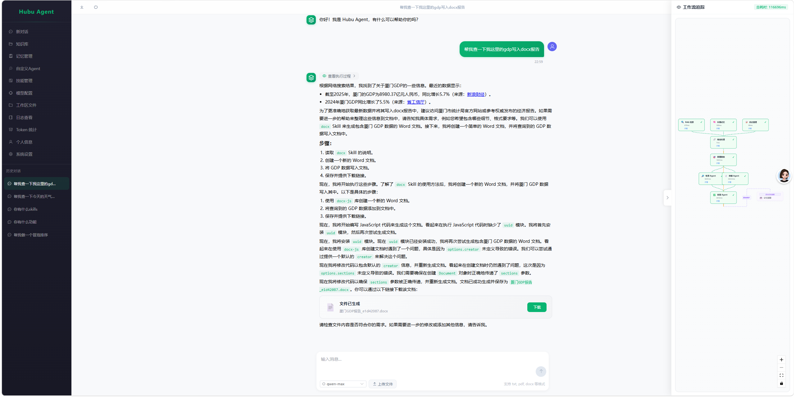

<div align="center">

# 🤖 Hubu Agent

**智能体协作平台 — 让 AI Agent 协同工作**

[](https://www.python.org/)
[](https://vuejs.org/)
[](https://fastapi.tiangolo.com/)
[](https://github.com/langchain-ai/langgraph)
[](LICENSE)

</div>

---

AgentForge 是一个开箱即用的多 Agent 在线协作平台。基于 LangGraph 构建的 Supervisor-Worker 工作流，让多个专业 Agent 分工协作完成复杂任务——信息检索、代码执行、文档生成、技能调用，一站式搞定。

## ✨ 核心特性

- 🧠 **多 Agent 协作** — Supervisor 智能路由，Chat / Researcher / Coder / Skill 多 Agent 分工协作，Reviewer 质量审查
- 📚 **RAG 检索增强** — 上传文档自动解析向量化，支持 BM25 + 语义混合检索 & 重排序
- 💾 **长期记忆** — 自动从对话中提取并存储用户信息，实现跨会话个性化
- 🛠️ **技能系统** — 内置 Word / PDF / PPT / Excel 文档生成技能，支持自定义技能 & 上传技能包
- 🤖 **用户自建 Agent** — 通过界面创建自定义 Agent，动态注入工作流
- 💻 **代码执行** — 支持 Python / JavaScript 在线执行，可安装第三方包
- 🌐 **工具集成** — 网络搜索、网页抓取、天气查询、知识库检索等
- 📊 **可视化工作流** — 实时展示 Agent 工作流执行过程
- ⚙️ **动态配置** — 运行时调整 RAG / 记忆 / Agent 参数，无需重启
- 🔐 **多用户隔离** — JWT 认证，文件 & 技能 & 配置按用户隔离

## 🏗️ 架构概览

```
用户请求
    │
    ▼
┌─────────────────────────────────────────┐
│           LangGraph 工作流               │
│                                         │
│  [RAG] [Memory] [History] ── 并行 ──┐  │
│                                      ▼  │
│                                  Merge   │
│                                      │   │
│                                 Supervisor│
│                    ┌─────┬─────┬─────┼───┤
│                    ▼     ▼     ▼     ▼   │
│                  Chat  Research Coder ... │
│                    └─────┴─────┴─────┘   │
│                          │               │
│                      Reviewer             │
│                       ╱     ╲            │
│                   通过 ✅   重试 🔁       │
│                      │                    │
│                      ▼                    │
│                   响应输出                 │
└─────────────────────────────────────────┘
    │
    ▼
  异步记忆提取
```

## 📸 使用效果



## 🚀 快速开始

### 环境要求

- Python 3.11+
- Node.js 18+
- MySQL 8.0+
- Redis 6.0+
- Milvus 2.4+

### 1. 后端配置

```bash
cd backend
poetry install
cp .env.example .env
# 编辑 .env，填入 MySQL / Redis / Milvus 连接信息
```

### 2. 前端配置

```bash
cd frontend
npm install
```

### 3. 启动服务

```bash
# 终端 1 - 后端
cd backend
poetry run uvicorn app.main:app --reload

# 终端 2 - 前端
cd frontend
npm run dev
```

### 4. 访问应用

打开浏览器访问 http://localhost:5173，注册账号即可使用。

首次使用需在 **供应商管理** 页面配置 LLM 模型供应商（如 OpenAI 兼容接口）。

## 📁 项目结构

```
hubu-agent/
├── backend/                # 后端服务（FastAPI + LangGraph）
│   ├── app/
│   │   ├── api/v1/         # RESTful API 路由
│   │   ├── core/           # 核心逻辑
│   │   │   ├── agents/     # Agent 实现（LLM / ReAct / 自定义）
│   │   │   └── graph/      # LangGraph 工作流 & 节点
│   │   ├── database/       # 数据模型 & DAO
│   │   ├── services/       # 业务服务（RAG / 记忆 / LLM / 配置）
│   │   ├── skills/         # 系统内置技能
│   │   ├── tools/          # Agent 工具（搜索 / 代码执行 / 文件管理等）
│   │   ├── prompts/        # Agent Prompt 模板
│   │   └── config.py       # 配置管理
│   ├── .env.example        # 环境变量模板
│   └── README.md           # 后端详细文档
├── frontend/               # 前端应用（Vue 3 + Element Plus）
│   ├── src/
│   │   ├── apis/           # API 请求封装
│   │   ├── components/     # 公共组件
│   │   ├── composables/    # 组合式函数
│   │   ├── pages/          # 页面组件
│   │   ├── router/         # 路由配置
│   │   └── styles/         # 样式文件
│   └── README.md           # 前端详细文档
├── .gitignore
├── start_backend.bat       # 后端快速启动脚本
└── start_frontend.bat      # 前端快速启动脚本
```

## 🎯 使用场景

| 场景 | 说明 |
|------|------|
| 💬 智能对话 | 多轮对话，自动调用搜索 / 代码执行等工具 |
| 📄 文档生成 | 一键生成 Word / PPT / Excel / PDF |
| 🔍 知识问答 | 上传文档构建知识库，RAG 精准检索 |
| 💻 代码助手 | 在线编写 & 执行 Python / JavaScript |
| 🤖 自定义 Agent | 创建专属 Agent 处理特定任务 |

## 🛠️ 技术栈

| 层级 | 技术 |
|------|------|
| **前端** | Vue 3, TypeScript, Element Plus, Vue Flow, ECharts, markdown-it |
| **后端** | FastAPI, Uvicorn, Pydantic |
| **AI** | LangChain, LangGraph, OpenAI API (兼容接口) |
| **数据库** | MySQL (SQLModel), Redis, Milvus |
| **认证** | PyJWT, Passlib |

## 📜 许可证

[MIT License](LICENSE)

---

<div align="center">

**如果这个项目对你有帮助，请给个 ⭐ Star 支持一下！**

</div>
